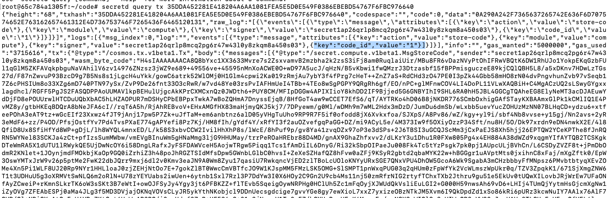

# FigmentLearn-FromZeroToYourFirstSecretNFT

This is a fork of the <a href="https://learn.figment.io/tutorials/create-your-first-secret-nft">Figment Secret NFT tutorial</a> written by Florian Uhde. Some of the key differences in following that tutorial include:

 - Integration with Keplr wallet
 - No API routes - all transactions are broadcast from the dApp and clientside only
 - Each user instantiates their own contract based off of <a href="https://secretnodes.com/secret/chains/secret-4/blocks/3797609/transactions/9268F2D526B3012E71FAF60644A90E4C0E8B5FB3AF9B6BA9DDA49CF09F39520F">code ID 532 secret-4 (mainnet)</a> and  code ID <a href="https://secretnodes.com/secret/chains/pulsar-2/blocks/3219046/transactions/2617DBE2A896D39AD7ACDA2E3D1DA0ED56D92DD1629B32F747B53B23DFF8526A">9744 on testnet pulsar-2 (testnet)</a>.
 - There is a [scripts directory](https://github.com/jamescharlesworth/FigmentLearn-FromZeroToYourFirstSecretNFT/tree/main/contract/scripts) to execute commands in node.js serverside, invoked through command line
 - The [snip721 code](https://github.com/jamescharlesworth/FigmentLearn-FromZeroToYourFirstSecretNFT/tree/main/contract) is a github submodule. Since writing this repo and the tutorial the contract has changed a bit, including breaking changes such as metadata living under `private_metadata.extension.<key>` wheras in the older version of the contract it was `private_metadata.<key>`.
 - Integration with [localsecret](https://docs.scrt.network/dev/LocalSecret.html#secretcli) to interact and run the cosmwasm js/secret node locally. This is good if you intend on making changes to the contract itself. For example you can see the metadata in [token.rs](https://github.com/baedrik/snip721-reference-impl/blob/632ce041aa79142820a6a6c455111776441f9d46/src/token.rs#L24-L67).


secretecli production settings:

```bash
> secretecli config
{
	"chain-id": "secret-4",
	"keyring-backend": "os",
	"output": "json",
	"node": "https://secret-4.api.trivium.network:26657/",
	"broadcast-mode": "sync"
}
```

secretcli testnet settings:
```bash
> secretecli config
{
	"chain-id": "pulsar-2",
	"keyring-backend": "test",
	"output": "json",
	"node": "https://rpc.pulsar.griptapejs.com:443",
	"broadcast-mode": "sync"
}
```
You can set these configs via command one at a time (is there a way to have profiles?)
```bash
secretcli config node <node>
secretcli config chain-id <node>
secretcli config keyring-backend <os | test>
```

## Compiling the contract locally

There is great documentation about [LocalSecret on docs.scrt.network](https://docs.scrt.network/dev/LocalSecret.html#secretcli) and setting up  that you should go through prior to continuing and will require you to have some [prerequisites](https://docs.scrt.network/dev/LocalSecret.html#prerequisites) such as docker setup.


Download the repo, set your terminal directory to it and pull down the submodule contract:
```
git clone git@github.com:jamescharlesworth/FigmentLearn-FromZeroToYourFirstSecretNFT.git my-example
cd my-example
git submodule update --init --recursive
```

### Prerequisites
Secret is built on top of cosmos which uses Rust to build the contracts using the cosmwasm framework.  You will need to have rust installed to continue. More information about [installing rust can be found here](https://www.rust-lang.org/tools/install). 

On a mac, I was able to install rust following steps 1, 2 and 4 outlined [here](https://docs.scrt.network/dev/quickstart.html#setup-secret-contracts). They are:
1. Install Rust
```sh
curl --proto '=https' --tlsv1.2 -sSf https://sh.rustup.rs | sh
source $HOME/.cargo/env
```
2. Add rustup target wasm32 for both stable and nightly 
```
rustup default stable
rustup target list --installed
rustup target add wasm32-unknown-unknown

rustup install nightly
rustup target add wasm32-unknown-unknown --toolchain nightly
```
4. Run cargo install cargo-generate
```sh
cargo install cargo-generate --features vendored-openssl
```
### Compiling the contract
cd into the snip721 contract directory and run the build:
```sh
cd contract/my-snip721
make build
```
this will create the contract.wasm(7.8) and contract.wasm.gz (591kb) file which are still pretty large and need further optimization to deploy to local testnet. Tom optimize the contract using docker and the secret contract optimizer run:
```sh
docker run --rm -v "$(pwd)":/contract \
  --mount type=volume,source="$(basename "$(pwd)")_cache",target=/code/target \
  --mount type=volume,source=registry_cache,target=/usr/local/cargo/registry \
  enigmampc/secret-contract-optimizer
```
This takes about 15 minutes and will compile the contract down to 230kb.

### Loading the contract into local secret testnet

Start local sercet with the current directory (scripts/my-snip721) mounted to `/root/code`
```sh
docker run -it --rm \
 -p 26657:26657 -p 26656:26656 -p 1337:1337 -p5000:5000 -p 9091:9091 \
 -v $(pwd):/root/code \
 --name localsecret ghcr.io/scrtlabs/localsecret
 ```

 open a new terminal and enter the docker container:
 ```sh
 docker exec -it localsecret /bin/bash
 ```

 Once in the container cd into `/root/code` and upload the contract:
 ```sh
 # from docker container
 cd /root/code
 secretd tx compute store contract.wasm.gz --from a --gas 5000000 -y --keyring-backend test
```
A few points here:
 - inside docker container, the command line cli for secret is `secretd` not `secretcl`. They are based off the same thing but `secretd` is for node operators and that is what we are here.
 - we need to set the gas to `5000000` to complete the transaction

Upload the contract:
```
 secretd tx compute store contract.wasm.gz --from a --gas 5000000 -y --keyring-backend test
 ```

 You should get a response back with JSON containing the txhash.
 ```json
{"height":"0","txhash":"35DDA452281E418204A6AA1081FEA5E5D0E549F0386EBEBD54767F6FBC976640","codespace":"","code":0,"data":"","raw_log":"[]","logs":[],"info":"","gas_wanted":"0","gas_used":"0","tx":null,"timestamp":"","events":[]}
```

The transaction / upload is asynchronous so you will need to run a query to get the contract code id.  

> In Secret the contract you upload will have a single Code ID. Everytime you instantiate the contract you use that code ID to get a new contract address.  You will then interact with that contract address.

Next you will need to get the code ID of the contract. On local testnet you will only have one contract so you can see it by running
```
secretd query compute list-code
```
which should give you ouput like:
```json
[
  {
    "id": 1,
    "creator": "secret1ap26qrlp8mcq2pg6r47w43l0y8zkqm8a450s03",
    "data_hash": "264C1121B3F39170583F7FF344CB4A17A52888EDFAEC03DE0D10015DD5A54BB8"
  }
]
```
The code ID is 1.

On live testnet or production you can query the trasnaction using the txhash described above:
secretd query compute list-code
```sh
secretd query tx <TXHASH_OUTPUT_FROM_UPLOAD>
```
you will then need to scroll to the top of the output and find the code id:


At this point we have all we need for the dApp and will instantiate the contract from there using the code id, however you can also instaniate and interact with the contract from the secretd client if you like. There are more docs [here](https://docs.scrt.network/dev/quickstart.html#create-initial-smart-contract) on doing that with another example contract.

The dApp is located at [https://figment-learn-from-zero-to-your-first-secret-nft.vercel.app/](https://figment-learn-from-zero-to-your-first-secret-nft.vercel.app/).